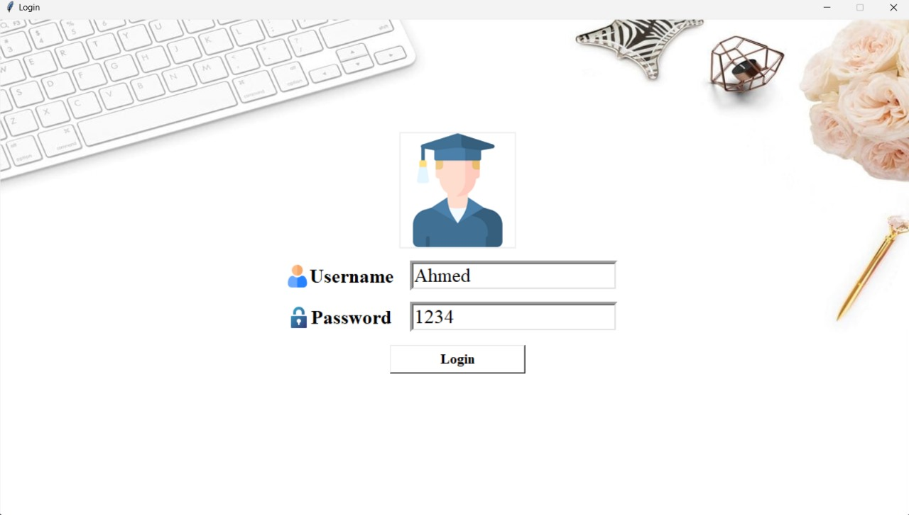
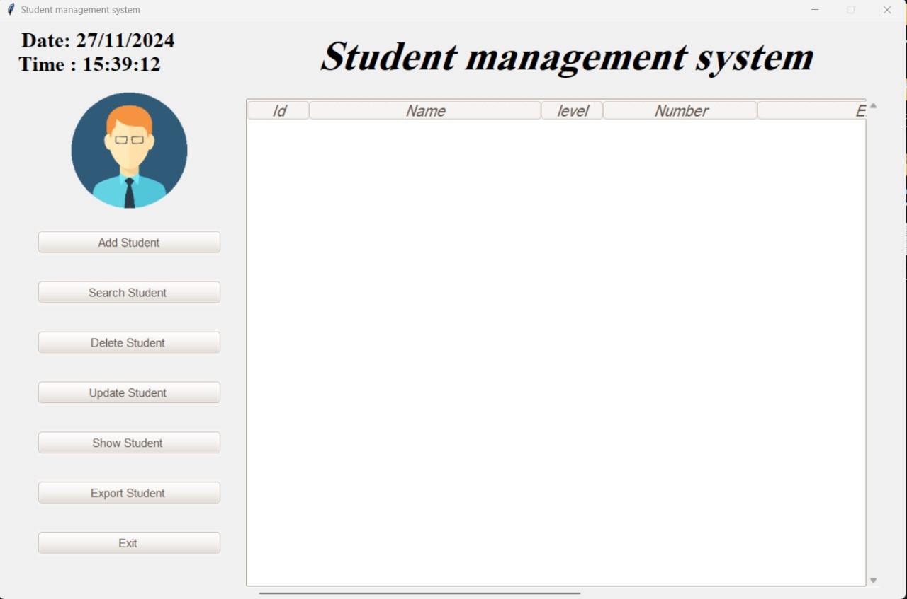
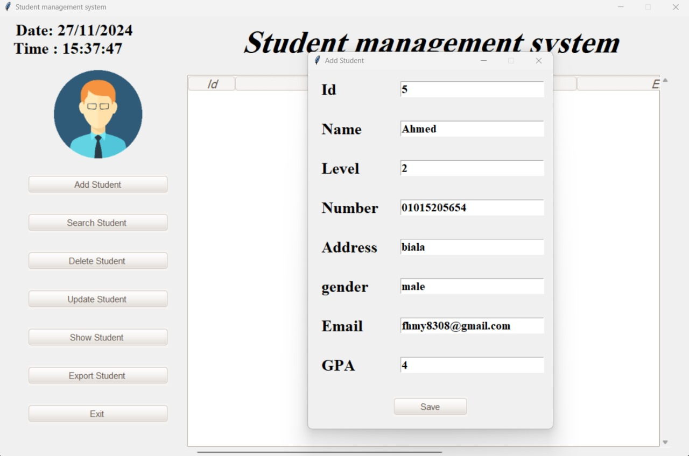

# Python Student Management System with Tkinter GUI and MySQL

Create a comprehensive Student Management System using Python, Tkinter for the graphical user interface, and MySQL for database management. This project aims to facilitate efficient management of student information, including details such as names, grades, and contact information.

## Features:

1. **User-friendly Interface:**
   - Implement a Tkinter-based GUI for a seamless and intuitive user experience.
   - Include navigation menus, buttons, and input fields to facilitate easy interaction.

2. **Database Integration:**
   - Utilize MySQL to store and manage student data.
   - Design a relational database schema to store information such as student ID, name, grade, contact details, and more.

3. **Student Registration:**
   - Create a registration module to add new students to the system.
   - Include fields for entering essential details like name, grade, contact information, etc.

4. **Data Display and Modification:**
   - Implement functionalities to view and modify student details.
   - Allow users to update information such as grades, contact details, etc.

5. **Search and Filtering:**
   - Provide search functionality to quickly locate specific students.
   - Implement filters to group and display students based on criteria such as grades or enrollment year.

6. **Reports and Analytics:**
   - Generate reports on student performance, attendance, and other relevant metrics.
   - Include graphical representations for a visual understanding of data.

7. **Data Validation:**
   - Ensure data integrity by implementing input validation for user-entered information.
   - Display meaningful error messages to guide users in providing correct information.

## Screenshots
### 1. log-in

---

### 2. Home Page

---

### 3. Add Student

## How to Run:

1. Install necessary Python libraries (Tkinter,  pymysql ,  pandas , ttkthemes , PIL , etc.).
2. Set up a MySQL database with the required schema.
3. Configure the application to connect to the MySQL database.
4. Run the Python script to launch the Student Management System.

**Note:**
Ensure that you have the required dependencies installed before running the application. This project provides a robust and efficient solution for managing student information in an educational environment.
